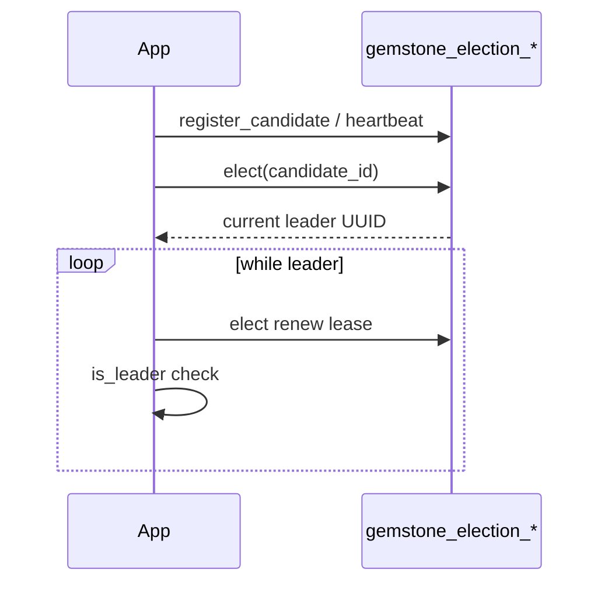

# SQL-backed leader election (`gemstone_utils.election`)

Optional **leader election** for multi-worker applications that already use `gemstone_utils.db`. Candidates register in the database, heartbeats keep them eligible, and `elect` acquires or renews a **lease** on a per-namespace leader row. Leader-only work should be gated with `is_leader`.

Import the module to register models on the shared `GemstoneDB` base (see `gemstone_utils.db`). Tables are created by `init_db` after `import gemstone_utils.election`.

## Concepts

| Concept | Description |
|---------|-------------|
| **Namespace** (`ns`) | Isolated election domain; defaults to `"default"`. Use separate namespaces when unrelated subsystems share one database. |
| **Candidate** | Process identity as a `UUID`. Must call `register_candidate` / `heartbeat` so `expires_at` stays in the future. |
| **Leader lease** | Row in `gemstone_election_leader` with `leader_id` and `lease_expires_at`. Renewed by `elect` when the caller is (or becomes) leader. |
| **Expiry window** | `set_expire(sec)` (default **60** seconds) extends both candidate `expires_at` and leader `lease_expires_at` on each qualifying call. |

## Schema

### `gemstone_election_candidate` (`ElectionCandidate`)

| Field | Role |
|-------|------|
| `ns` | Namespace PK (part 1). |
| `candidate_id` | UUID string PK (part 2). |
| `last_heartbeat_at` | UTC timestamp of last register/heartbeat/elect touch. |
| `expires_at` | Candidate considered **inactive** when `expires_at <= now`. |

### `gemstone_election_leader` (`ElectionLeader`)

| Field | Role |
|-------|------|
| `ns` | Namespace PK. |
| `leader_id` | UUID string of current leader, or `None` when vacant. |
| `lease_expires_at` | Leader lease end; `None` when vacant. |
| `updated_at` | UTC timestamp of last leader-row change. |

## Typical application loop

**Startup**

1. `set_expire(sec)` once if the default 60s window is wrong for your heartbeat interval.
2. `init_db(db_url)` after importing `gemstone_utils.election` (and any other `GemstoneDB` plugins).
3. Choose a stable `candidate_id` (`UUID`) per process instance.
4. `register_candidate(candidate_id, ns=...)`.

**Background**

- On a timer shorter than `set_expire`: `heartbeat(candidate_id)` and `elect(candidate_id)`.
- Before leader-only work: `if is_leader(candidate_id): ...`.

**Shutdown**

- `unregister_candidate(candidate_id)` removes the candidate and clears the leader row if this instance was leader (faster failover).

All public functions accept an optional `session=` so you can share a transaction with other `GemstoneDB` work. When omitted, each call opens and closes a session via `get_session()`.

## Protocol rules

- **`elect`** returns the **current leader UUID after the call** — which may be the caller or another candidate.
- Leadership is assigned when there is **no leader**, the **lease is expired**, or the **caller is the current leader** (lease renewal).
- If another candidate holds an unexpired lease, `elect` does **not** preempt; the return value is that leader's id.
- **`heartbeat`** is an alias for `register_candidate` (creates the row if missing).
- **`list_candidates`** returns UUIDs with `expires_at > now` only.
- **`unregister_candidate`** deletes the candidate row; if that candidate was leader, clears `leader_id` and `lease_expires_at` on the leader row.

## Implementation notes

- **Row locking:** `elect` uses `SELECT ... FOR UPDATE` on the leader row when the driver supports it; SQLite and some drivers fall back to a plain `get` without row lock.
- **Contention:** Creating the leader row under concurrent `elect` calls may raise `IntegrityError` once; the implementation retries the transaction once, then reads the current leader.
- **Not consensus:** This is a **single-database lease** pattern, not Raft or Paxos. Correctness depends on all participants using the same database and respecting `is_leader` / lease expiry.
- **Limitations:** Clock skew between app hosts and the database can shorten or lengthen perceived leases. If the database is unavailable, election stops. Processes that ignore `is_leader` and run leader work anyway can cause split-brain regardless of lease state.

## Public API

See [api.md](api.md#leader-election-gemstone_utilselection). Related: [key-storage.md](key-storage.md) (shared `init_db` and `GemstoneDB` pattern). Introduced in v0.2.0 as `emerald_utils.election`; see [RELEASE_NOTES.md](../RELEASE_NOTES.md).
